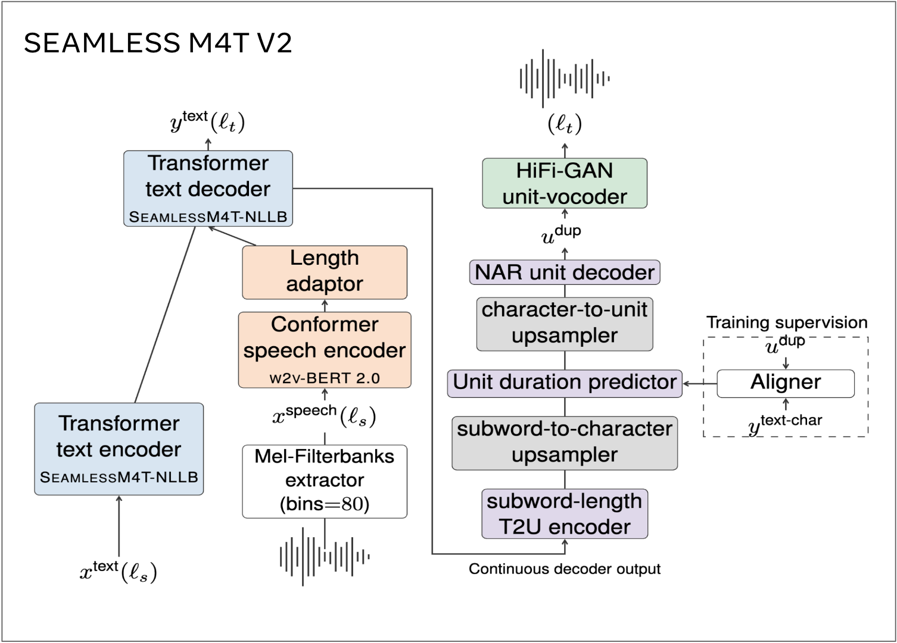

# Machine-Translation

## Description

This project showcases a machine translation system from **Hindi to Tamil** built using the **Seamless M4T v2 Large** model. By fine-tuning the model on a large dataset from [AI4Bharat](https://ai4bharat.org/), we improved its performance significantly, as measured by the BLEU score on a test set of **5000 sentences**.

---

## Results

Here’s how the model performed before and after fine-tuning:

- **Baseline BLEU Score**: `41.35`
- **Fine-Tuned BLEU Score**: `48.00`

This represents a **notable improvement** in translation quality, making the model more effective for Hindi-to-Tamil translation tasks.

---

## Model Details

The **Seamless M4T v2 Large** is a state-of-the-art multilingual machine translation model designed for high-quality translations across various languages. It consists of **2.31B** parameters. For this project, we fine-tuned:

- **Last Decoder Layer**: Adapts the output generation to the Tamil language.
- **Language Model Head**: Enhances the fluency and accuracy of translations.

Below is a visual representation of the model architecture:

---

## Fine-Tuning Details

The fine-tuning process utilized a robust dataset from [AI4Bharat](https://ai4bharat.org/), consisting of **1 million rows** of Hindi-Tamil parallel sentences. We focused on updating only the **last decoder layer** and the **language model head**, keeping the rest of the model’s parameters frozen. This approach allowed us to efficiently adapt the pre-trained model to our specific language pair while leveraging its existing knowledge.

---

